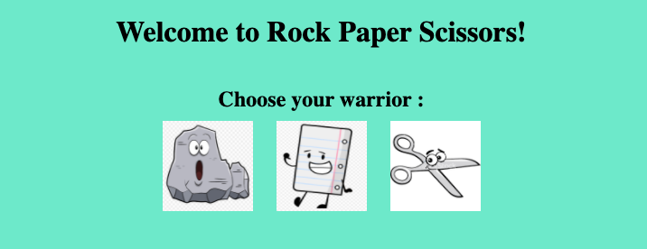

# Rock-Paper-Scissors
This is a simple Rock-Paper-Scissors game created from scratch using HTML, CSS and Javascript.
More features are yet to be added.
# Instructions for Running
1. Use the green code button to copy this https/ssh link.
2. Navigate to the directory where you want the file to be stored.
3. Run `git clone paste-the-https/ssh`
4. Open the 'index.html' file in your browser.
### If everything went right you should see this in your browser

### Clicking one of the icons will start the game.